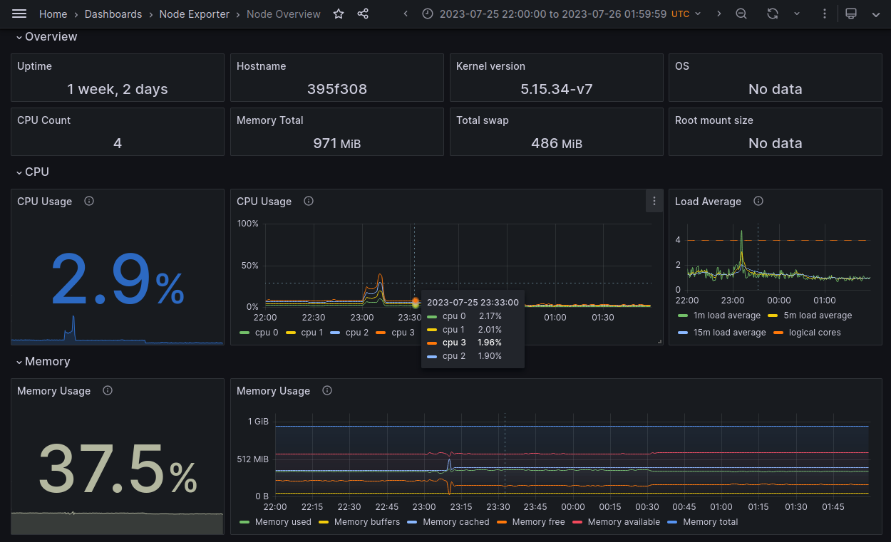
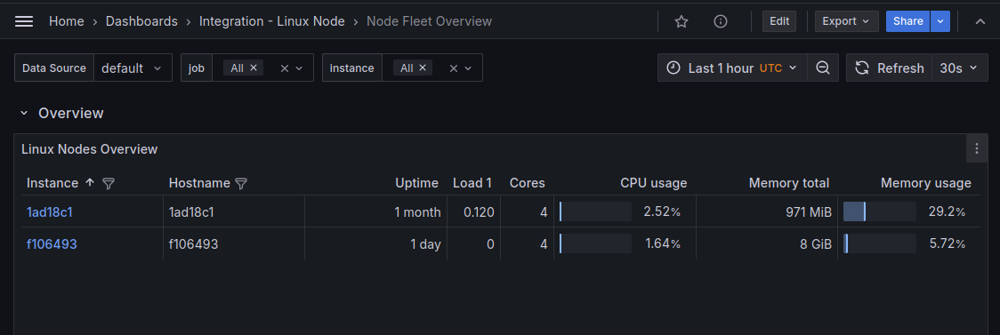
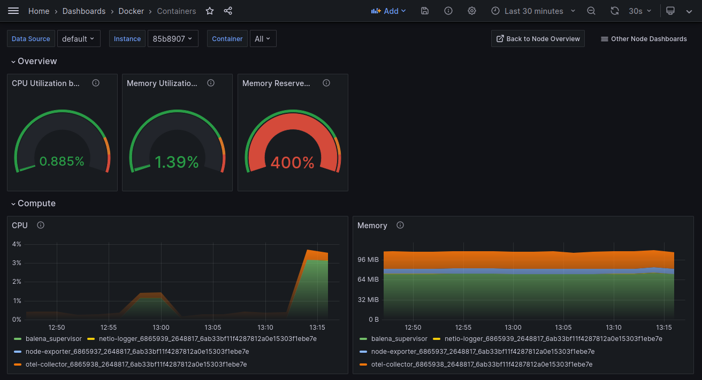

OpenTelemetry [Collector](https://opentelemetry.io/docs/collector/) for device monitoring to a Prometheus backend, packaged as a [balenaBlock](https://docs.balena.io/learn/develop/blocks/#using-your-block-in-other-projects) per architecture. (See block for [aarch64](https://hub.balena.io/blocks/2068757/otel-collector-device-prom-aarch64), [amd64](https://hub.balena.io/blocks/2068764/otel-collector-device-prom-amd64), [armv7hf](https://hub.balena.io/blocks/2068759/otel-collector-device-prom-armv7hf).) Requires 110 MB disk space and 40 MB memory.

## Getting Started
There are two parts to getting started: setting up the Prometheus backend integration, and configuring the collector for your fleet.

For Prometheus it's easy to create a free account at [Grafana Cloud](https://grafana.com/products/cloud/). Note the *team* name created for you is used in the URL for your Grafana account, like `https://grafana.com/orgs/{team}`, and in the URL for your cloud dashboards, like `https://{team}.grafana.net` .

After registering, install the Linux Server integration ([instructions](https://grafana.com/docs/otel-collector-device-prom/data-configuration/get-started-integration/)) for your cloud, which will create pre-configured dashboards based on Prometheus. On the setup page, *don't* install the agent. Instead, at the bottom of the page, select *Install* in the section *Install Dashboards and Alerts* ([screenshot](docs/install-linux-integration.png)). Then you can view your dashboards although they are not receiving data yet.

Next, create a docker-compose file with  *otel-collector* and *node-exporter* service entries that reference the block, like [this example](https://github.com/balena-io-experimental/otel-collector-device-prom/blob/master/docs/example). In balenaCloud dashboard, create a fleet for your devices, and [push](https://docs.balena.io/learn/deploy/deployment/#balena-push) that service composition to your fleet to generate a release.

Finally, set fleet [variables](https://docs.balena.io/learn/manage/variables/#fleet-wide-variables) for the *otel-collector* service for Prometheus username, password, and remote write URL using the values from your Grafana Cloud Prometheus service page ([screenshot](docs/prometheus-config.png)). The service page is available from your Grafana account site (`grafana.com/orgs/{team}`), not the cloud dashboard.

| Variable | Prometheus service page reference |
| -------- | --------------------------------- |
| PROMETHEUS_URL | Remote Write Endpoint |
| PROMETHEUS_USER | Username / Instance ID |
| PROMETHEUS_PASSWORD | An API key you must create |

With this setup in place, you now can add devices to your fleet. They will start to send metrics data to Grafana Cloud, which you may view in the fleet overview dashboard, like below.

## Container Metrics
The collector also captures metrics for your application containers in balenaEngine. You can view these metrics in Grafana by importing a dashboard definition file in the `docs/dashboards` directory. The screenshot below is based on `containers.json`. See the Grafana [instructions](https://grafana.com/docs/grafana/latest/dashboards/manage-dashboards/#export-and-import-dashboards) for importing a dashboard.

