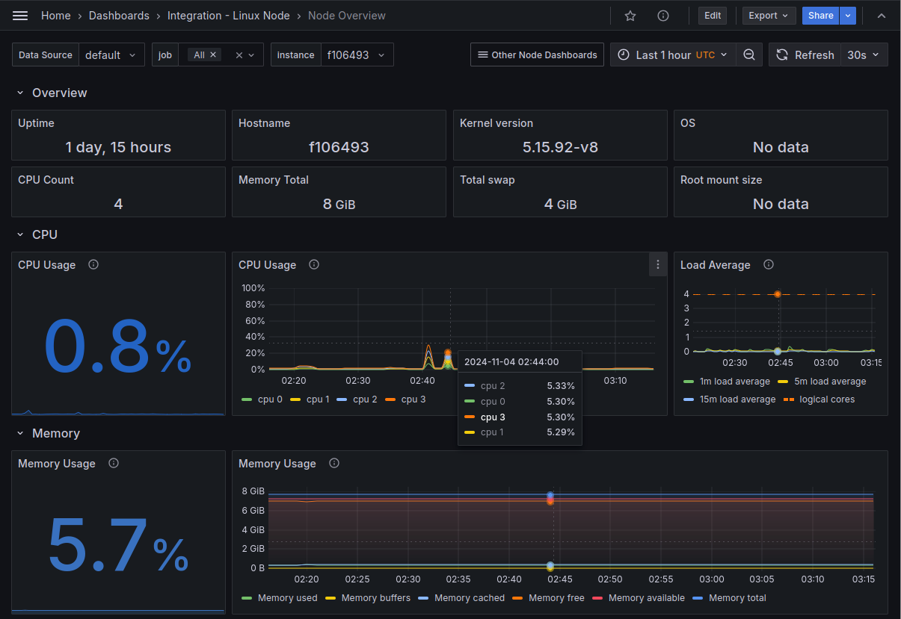
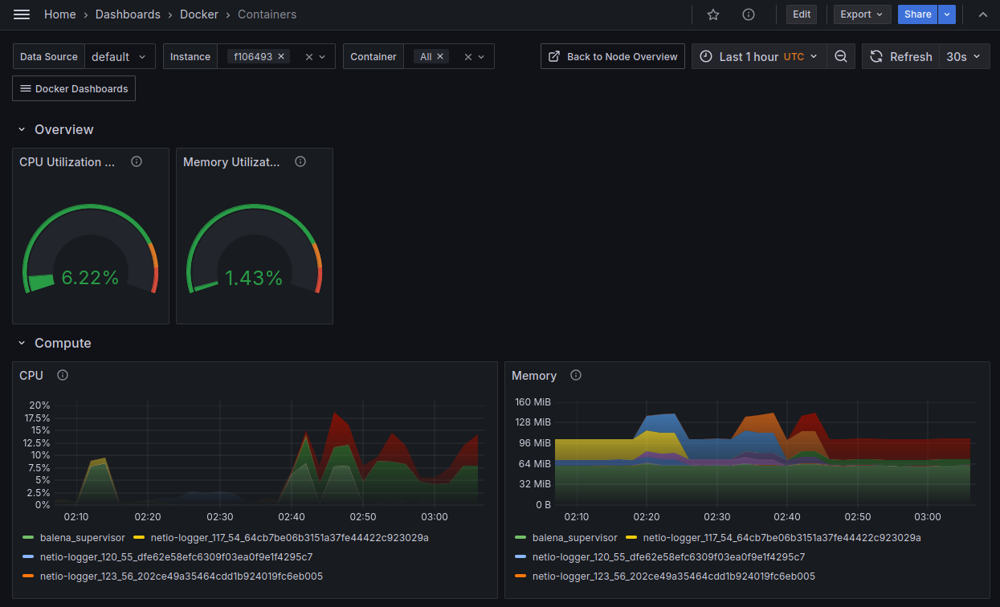

OpenTelemetry [Collector](https://opentelemetry.io/docs/collector/) for device monitoring to a Prometheus and Loki backend, packaged as a [balenaBlock](https://docs.balena.io/learn/develop/blocks/#using-your-block-in-other-projects) per architecture. (See block for [aarch64](https://hub.balena.io/blocks/2068757/otel-collector-device-prom-aarch64), [amd64](https://hub.balena.io/blocks/2068764/otel-collector-device-prom-amd64), [armv7hf](https://hub.balena.io/blocks/2068759/otel-collector-device-prom-armv7hf).) Includes Container [metrics](#container-metrics) and device journal [logs](#device-journal-logs). Requires 120 MB disk space and 40 MB memory.



# Getting Started
There are two parts to getting started: setting up the Prometheus and Loki backend integration, and configuring the collector for your fleet.

For Prometheus and Loki it's easy to create a free account at [Grafana Cloud](https://grafana.com/products/cloud/). Note the *team* name created for you is used in the URL for your Grafana account, like `https://grafana.com/orgs/{team}`, and in the URL for your cloud dashboards, like `https://{team}.grafana.net` .

After registering, install the Linux Server integration ([instructions](https://grafana.com/docs/grafana-cloud/monitor-infrastructure/integrations/get-started/)) for your cloud, which will create pre-configured dashboards based on Prometheus and Loki. On the setup page, *don't* install the agent. Instead, at the bottom of the page, select *Install* in the section *Install Dashboards and Alerts* ([screenshot](docs/install-linux-integration.png)). Then you can view your dashboards although they are not receiving data yet.

Next, create a docker-compose file with  *otel-collector* and *node-exporter* service entries that reference the block, like [this example](https://github.com/balena-io-experimental/otel-collector-device-prom/blob/master/docs/example). In balenaCloud dashboard, create a fleet for your devices, and [push](https://docs.balena.io/learn/deploy/deployment/#balena-push) that service composition to your fleet to generate a release.

Finally, set fleet [variables](https://docs.balena.io/learn/manage/variables/#fleet-wide-variables) for the *otel-collector* service for Prometheus username, password, and remote write URL using the values from your Grafana Cloud Prometheus service page ([screenshot](docs/prometheus-config.png)). The service page is available from your Grafana account site (`grafana.com/orgs/{team}`), not the cloud dashboard. Optionally to collect journal logs and forward to Loki, set variables for the Loki user and remote URL using the Grafana Cloud Loki service page ([screenshot](docs/loki-config.png)).

| Variable | Required / Optional |Service page reference |
| -------- | ------------------- | ---------------------- |
| PROMETHEUS_URL | Required | Remote Write Endpoint, like `prometheus-xxx-us-east-0.grafana.net/api/prom/push` |
| PROMETHEUS_USER | Required | Username / Instance ID |
| PROMETHEUS_PASSWORD | Required | An API key you must create |
| LOKI_URL | Optional | URL, like `logs-xxx.grafana.net` |
| LOKI_USER | Optional | User |


With this setup in place, you now can add devices to your fleet. They will start to send metrics data to Grafana Cloud, which you may view in the fleet overview dashboard, like below. Clicking on an item in the Instance column displays the Node Overview dashboard, like at the top of this document.


## Container Metrics
The collector also captures metrics for your application containers in balenaEngine. You can view these metrics in Grafana by importing a dashboard definition file in the `docs/dashboards` directory. The screenshot below is based on `containers.json`. See the Grafana [instructions](https://grafana.com/docs/grafana/latest/dashboards/manage-dashboards/#export-and-import-dashboards) for importing a dashboard.



## Device Journal Logs
The collector also captures journal logs for the device. The Linux Server integration already includes a Logs dashboard, but you need to update or replace it with the content of the dashboard definition in `docs/dashboard/node-logs.json`. The screenshot below is based on this file. Notice that by selecting a line in the Logs panel, the container that generated the log line diplays.


# Debugging
Presently the collector block does not have a switch to enable debug logging. However, you can add this logging if you build the collector binary locally. Try the tools below and read the collector Troubleshooting [docs](https://opentelemetry.io/docs/collector/troubleshooting/).

## Internal logging
The OpenTelemetry collector can generate internal logs. Add a stanza like below to the *service* section. See the collector's Internal Telemetry [docs](https://opentelemetry.io/docs/collector/internal-telemetry/) for more.

```
  telemetry:
    logs:
      level: "debug"
```

## Debug exporter
To see what an exporter is sending to the backend, add this stanza to the *exporters* section. See the *Local exporters* [section](https://opentelemetry.io/docs/collector/troubleshooting/#local-exporters) of the collector's Troubleshooting docs.

```
  debug:
    verbosity: normal
```

Then add "debug" to the exporters list in the pipeline of interest, for example:

```
service:
  pipelines:
    metrics/prom:
      receivers: [prometheus]
      processors: [batch]
      exporters: [prometheusremotewrite, debug]
```